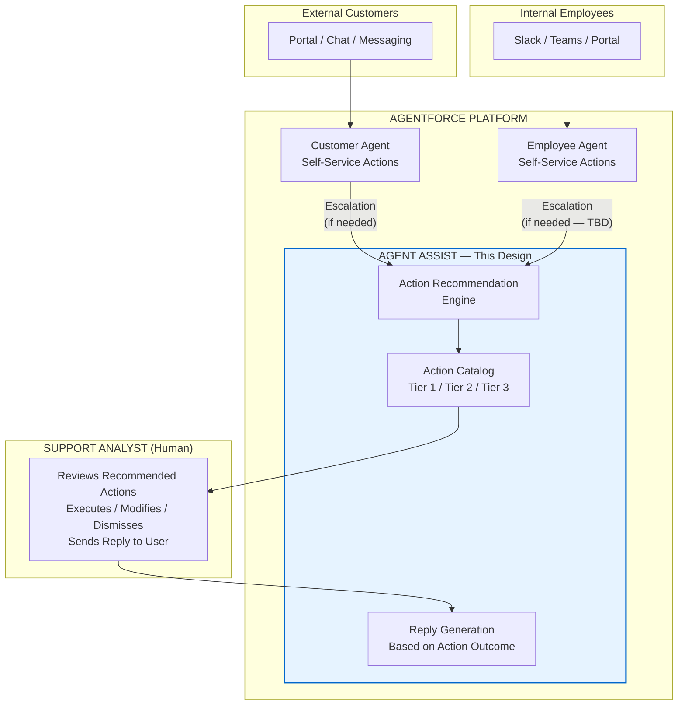
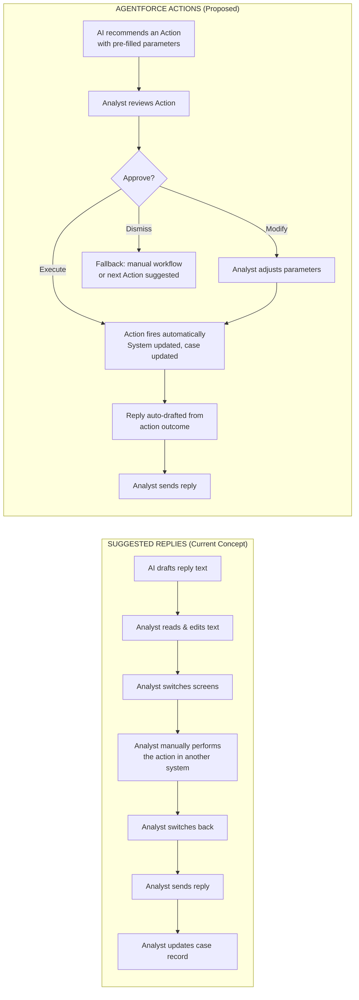
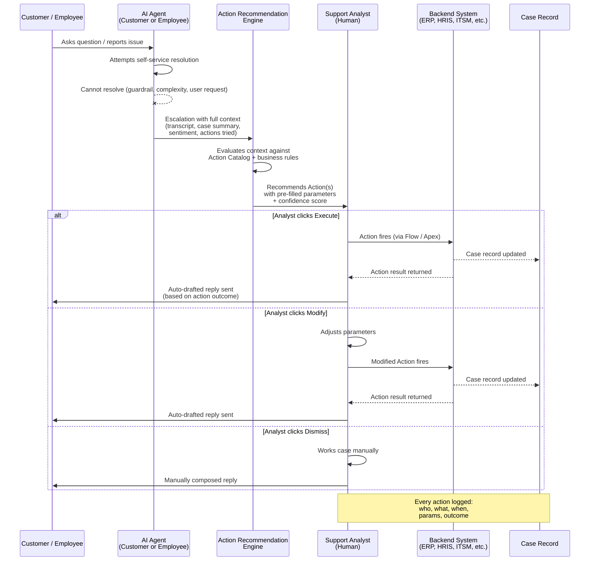
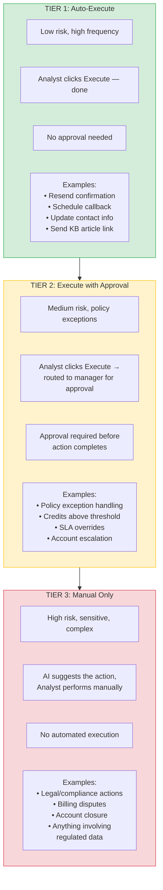
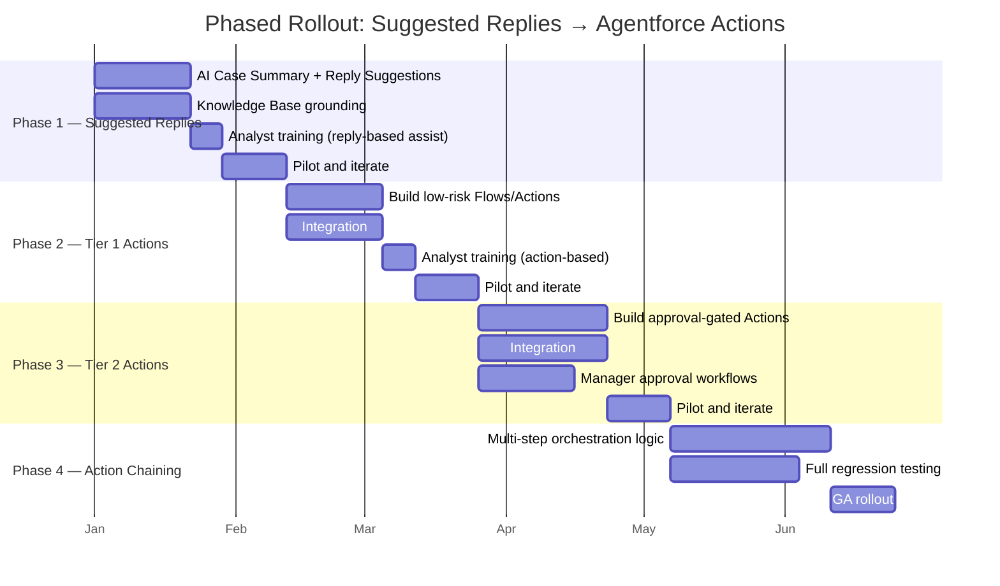
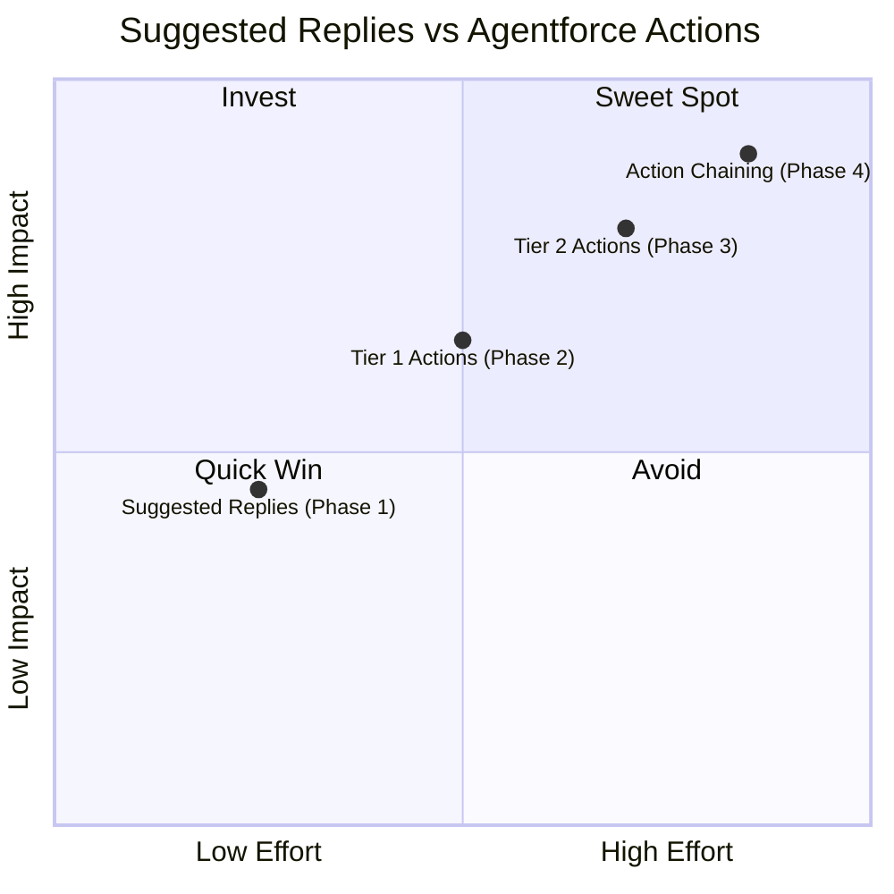
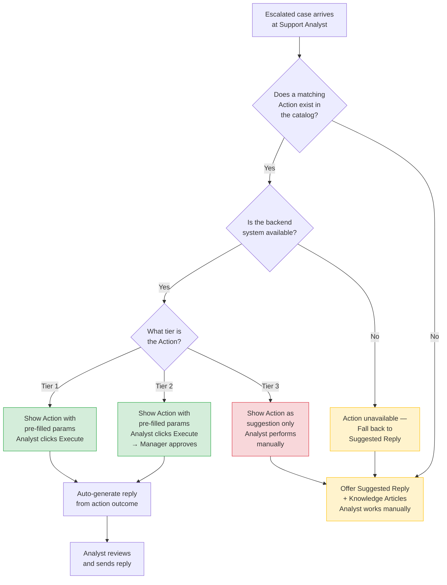
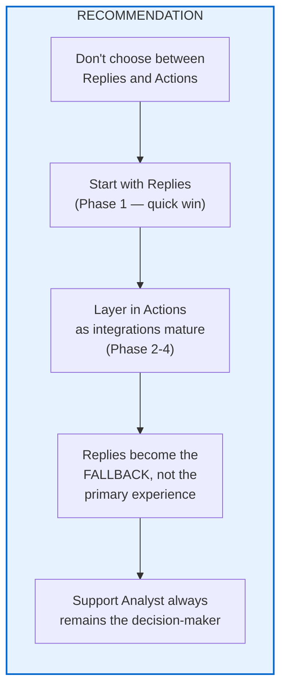

# Replacing Suggested Replies with Agentforce Actions for Support Analysts

## Solution Design Document

**Date:** 2026-02-26 15:22:32  
**Author:** RuslanRV  
**Status:** Draft — Pending team review  
**Related Issue:** [#3 — Agentforce Integration: Option Review, Open Questions, and Next Steps](https://github.com/RuslanRV/P2CAgentforce_A-D/issues/3)

---

## Table of Contents

1. [Executive Summary](#1-executive-summary)
2. [Where This Fits in the Overall Architecture](#2-where-this-fits-in-the-overall-architecture)
3. [The Core Concept: Replies vs Actions](#3-the-core-concept-replies-vs-actions)
4. [Action Recommendation Flow (End-to-End)](#4-action-recommendation-flow-end-to-end)
5. [Action Tier Model](#5-action-tier-model)
6. [Error Handling: What Happens When an Action Fails](#6-error-handling-what-happens-when-an-action-fails)
7. [Phased Rollout: Replies → Actions](#7-phased-rollout-replies--actions)
8. [Pros and Cons](#8-pros-and-cons)
9. [Decision Framework: When to Use Which](#9-decision-framework-when-to-use-which)
10. [Support Analyst Workflow: Before vs After](#10-support-analyst-workflow-before-vs-after)
11. [Open Questions](#11-open-questions)
12. [Final Recommendation](#12-final-recommendation)

---

## 1. Executive Summary

This document proposes replacing **Suggested Replies** (AI-drafted text for Support Analysts) with **Agentforce Actions** (AI-recommended executable operations) in the Agent Assist panel within the Salesforce Service Cloud console.

**The core insight:**
- **Suggested Replies** tell the Support Analyst **what to say**.
- **Agentforce Actions** help the Support Analyst **what to do** — and the reply writes itself because it describes what *actually happened*.

The recommendation is a **phased approach**: start with Suggested Replies for quick value, then layer in Actions as integrations mature. At every phase, the **Support Analyst remains the decision-maker**.

---

## 2. Where This Fits in the Overall Architecture

This design addresses **what happens after escalation** — specifically, how the Support Analyst (human) is assisted by Agentforce once a Customer Agent or Employee Agent hands off a case.



---

## 3. The Core Concept: Replies vs Actions



### Concept Summary Table

| Aspect | Suggested Replies | Agentforce Actions |
|---|---|---|
| What it does | Drafts text for the Analyst | Executes the resolution + drafts text from outcome |
| Analyst role | Reads, edits, pastes, then manually performs the action | Reviews, clicks Execute, sends auto-drafted reply |
| Context switches | 3+ per case | 0 |
| Backend integration needed | No (Knowledge Base only) | Yes (ERP, HRIS, ITSM, etc.) |

---

## 4. Action Recommendation Flow (End-to-End)



### Escalation Payload (Context Passed to Action Recommendation Engine)

The following context is passed from the AI Agent to the Action Recommendation Engine at escalation:

| Field | Description |
|---|---|
| Conversation transcript | Full history of user ↔ AI Agent interaction |
| AI-generated case summary | Concise summary of the issue |
| Customer/employee profile | Account tier, history, open cases, LTV (if applicable) |
| Sentiment score & trend | Current sentiment and how it changed during conversation |
| Actions already attempted | What the AI Agent tried (to avoid repeating) |
| Escalation reason code | Why the AI Agent escalated (explicit request, guardrail, confidence, etc.) |
| Matched Knowledge articles | Articles the AI Agent referenced during the conversation |

---

## 5. Action Tier Model



### Tier Classification Table

| Tier | Risk Level | Execution | Approval | Audit | Use When |
|---|---|---|---|---|---|
| **Tier 1** | Low | Automated (Analyst clicks Execute) | None | Logged | Action is safe, reversible, and high-frequency |
| **Tier 2** | Medium | Automated after approval | Manager/supervisor | Logged + approver recorded | Action has financial impact, is an exception to policy, or affects SLA |
| **Tier 3** | High | Manual only (AI suggests, Analyst performs) | N/A (manual) | Analyst logs manually | Action is legally sensitive, irreversible, or involves regulated data |

> **Note:** Tier classification is configured per action by the admin team. The business controls the risk dial — actions can be promoted or demoted between tiers as confidence and testing mature.

---

## 6. Error Handling: What Happens When an Action Fails

```mermaid
flowchart TB
    A[Analyst clicks Execute] --> B{Action succeeds?}

    B -- "Yes" --> C[Case updated<br/>Reply auto-drafted<br/>Audit logged]
    C --> D[Analyst sends reply]

    B -- "No: Backend system down" --> E[Graceful degradation]
    E --> E1["Analyst sees: 'Action could not<br/>complete — system unavailable'"]
    E1 --> E2["Analyst falls back to manual workflow"]
    E2 --> E3["Suggested Reply offered as fallback"]

    B -- "No: Validation error" --> F[Parameter issue]
    F --> F1["Analyst sees: 'Record not eligible<br/>for this action — reason: X'"]
    F1 --> F2["Analyst can Modify params<br/>and retry, or Dismiss"]

    B -- "No: Partial completion" --> G[Rollback required]
    G --> G1["Action rolls back<br/>any partial changes"]
    G1 --> G2["Analyst notified:<br/>'Action rolled back — no<br/>changes were made']
    G2 --> G3["Analyst can retry or go manual"]

    style E fill:#fff3cd,stroke:#ffc107
    style F fill:#fff3cd,stroke:#ffc107
    style G fill:#f8d7da,stroke:#dc3545
```

### Error Handling Requirements

| Failure Type | User Experience | System Behavior | Fallback |
|---|---|---|---|
| Backend system unavailable | "Action could not complete — system unavailable" | Retry with exponential backoff (configurable) | Suggested Reply + manual workflow |
| Validation error | "Record not eligible — reason: [specific reason]" | No changes made | Analyst modifies params or dismisses |
| Partial completion | "Action rolled back — no changes were made" | Automatic rollback of partial changes | Analyst retries or goes manual |
| Timeout | "Action timed out — please try again" | No changes made (or rollback if partial) | Retry or manual |

---

## 7. Phased Rollout: Replies → Actions



> **⚠️ Timeline is illustrative.** Actual durations depend on team capacity, integration complexity, and Knowledge Base readiness — all of which are open questions in [Issue #3](https://github.com/RuslanRV/P2CAgentforce_A-D/issues/3).

### Phase Details

| Phase | What Ships | Value Delivered | Effort | Risk |
|---|---|---|---|---|
| **Phase 1: Suggested Replies** | AI case summary + reply suggestions grounded in Knowledge Base | Analyst saves time on reading & composing replies | Low (prompt config + KB) | Low (AI only generates text) |
| **Phase 2: Tier 1 Actions** | Executable low-risk Actions (resend confirmation, schedule callback, update info) | Analyst skips context switching for routine tasks | Medium (build Flows, test integrations) | Low (actions are low-risk by design) |
| **Phase 3: Tier 2 Actions** | Approval-gated Actions for exceptions, credits, escalations | Major handle time reduction on complex cases | Higher (approval workflows, more integrations) | Medium (mitigated by approval gates) |
| **Phase 4: Action Chaining** | AI recommends a sequence of Actions; Analyst approves the plan | Near-autonomous case resolution with human oversight | High (orchestration, chaining, testing) | Medium (human still approves) |

---

## 8. Pros and Cons



### Pros of Replacing Suggested Replies with Actions ✅

| # | Pro | Detail |
|---|-----|--------|
| 1 | **Faster case resolution** | Actions execute the work — Analyst goes from "read, switch screens, perform, switch back, type" to "review, click, send." Eliminates context switching entirely. |
| 2 | **Fewer human errors** | Pre-filled parameters reduce manual data entry. The Action enforces standardized business logic regardless of which Analyst handles the case. |
| 3 | **Stronger audit trail** | Every Action execution is logged: who triggered it, parameters used, whether modified, who approved (Tier 2), and outcome. Far richer than "Analyst sent this reply text." |
| 4 | **Reply accuracy improves** | The reply is generated *after* the Action succeeds, describing *what actually happened* — not what the AI guessed should happen. |
| 5 | **Reuses existing Flows** | The same Flows/Apex built for the AI Agent's self-service can be exposed to the Analyst through Agent Assist. No duplicate automation. |
| 6 | **Human stays in control** | Actions are recommended, not auto-executed. Analyst always has Execute / Modify / Dismiss. Tier model lets the business control the risk level. |
| 7 | **Scales with maturity** | Start with Replies (Phase 1), add Tier 1 Actions, then Tier 2, then chaining. Each phase delivers incremental value. |

### Cons of Replacing Suggested Replies with Actions ❌

| # | Con | Detail | Mitigation |
|---|-----|--------|------------|
| 1 | **Higher build effort** | Actions require Flows, Apex, backend integrations, error handling, and tier classification. Significantly more engineering than prompt configuration. | Phased approach — Replies first, Actions layered in. |
| 2 | **Integration dependency** | Actions fail if backend systems are unavailable. Replies have no such dependency. | Graceful degradation: fall back to Suggested Replies when Actions can't execute. (See error handling diagram.) |
| 3 | **Risk of wrong action on real data** | A bug or misconfigured Action could process incorrect changes, update wrong records, etc. Replies can only produce bad text (easily fixable). | Sandbox testing, Tier model (high-risk actions need approval), rollback capability, and Action-level killswitches. |
| 4 | **Automation complacency** | Analysts may stop carefully reviewing parameters if Actions consistently work well, leading to rubber-stamping. | UX design: require parameter review before Execute is enabled. Tier 2 actions require confirmation dialog. Regular audits of Action execution logs. |
| 5 | **Longer time to first value** | Replies can be live in days. Actions require integration stack to be ready. | Phase 1 (Replies) delivers value immediately while Actions are built in parallel. |
| 6 | **Action coverage gap** | Not every escalation will have a matching Action. Novel or complex cases leave the Analyst without AI-assisted execution. | Design a clean fallback: when no Action matches, surface Suggested Replies + relevant Knowledge articles instead of an empty panel. |
| 7 | **Change management required** | Analysts must trust and adopt a new workflow. Some may feel their expertise is being diminished. | Involve Analysts in Action design. Pilot with volunteers. Position as "tool that handles the tedious parts" not "replacement for your judgment." |

### Side-by-Side Comparison

| Dimension | Suggested Replies | Agentforce Actions |
|---|---|---|
| What it does | Drafts text for the Analyst | Executes the resolution + drafts text from outcome |
| Build effort | Low | Medium to High |
| Integration needed | Knowledge Base only | KB + backend systems (ERP, etc.) |
| Time to launch | Days to weeks | Weeks to months |
| Handle time impact | Moderate (saves composition time) | Significant (saves composition + action execution time) |
| Error reduction | Low (Analyst still acts manually) | High (pre-filled params, automated execution) |
| Audit trail | Text sent | Action executed, params, approver, outcome logged |
| Risk if wrong | Bad reply text (fixable) | Wrong action on real data (harder to undo) |
| Fallback if AI fails | Analyst writes own reply | Analyst does action manually + writes reply |
| Best for | Fast first value, simple cases, no integrations yet | Mature orgs with integrations, high volume, repetitive escalations |
| **Verdict** | **Start here (Phase 1)** | **Graduate to this (Phase 2-4)** |

---

## 9. Decision Framework: When to Use Which



---

## 10. Support Analyst Workflow: Before vs After

### With Suggested Replies (Before)

| Step | Activity | Est. Time |
|---|---|---|
| 1 | Case arrives from escalation | ~0 min |
| 2 | Analyst reads AI transcript & case summary | ~1 min |
| 3 | Analyst reads suggested reply text | ~0.5 min |
| 4 | Analyst edits reply to match situation | ~1 min |
| 5 | Analyst switches to another tab/screen | ~0.5 min |
| 6 | Analyst manually performs the action (navigates to record, fills in fields, submits) | ~2 min |
| 7 | Analyst switches back to chat | ~0.5 min |
| 8 | Analyst sends reply to customer | ~0.5 min |
| 9 | Analyst updates case record | ~1 min |
| | **Total** | **~7.5 min** |
| | **Context switches** | **3+** |

### With Agentforce Actions (After)

| Step | Activity | Est. Time |
|---|---|---|
| 1 | Case arrives from escalation | ~0 min |
| 2 | Analyst reads AI summary + recommended Action | ~1 min |
| 3 | Analyst reviews pre-filled Action parameters | ~0.5 min |
| 4 | Analyst clicks Execute | ~0.1 min |
| 5 | Analyst reviews auto-drafted reply | ~0.5 min |
| 6 | Analyst clicks Send (or edits first) | ~0.5 min |
| | **Total** | **~2.6 min** |
| | **Context switches** | **0** |

### Estimated Impact

| Metric | Improvement |
|---|---|
| Time saved per case | ~4.9 min (65% reduction) |
| Context switches eliminated | 3+ per case |
| Error reduction | Pre-filled params = fewer typos and data entry mistakes |
| Analyst satisfaction | Less tedious, more impactful work |

> **⚠️ These estimates are illustrative.** Actual numbers depend on current workflows and should be validated with Support Analyst observation and case data.

---

## 11. Open Questions

These must be answered before detailed Action design begins. They are additive to the open questions already captured in [Issue #3](https://github.com/RuslanRV/P2CAgentforce_A-D/issues/3).

| # | Question | Why It Matters | Suggested Owner |
|---|----------|----------------|-----------------|
| 1 | What are the top 5 most common actions Support Analysts perform after receiving an escalation? | Drives which Actions to build first (Phase 2) | Support Analyst team lead |
| 2 | What backend systems do Analysts interact with during case resolution? | Determines integration scope and effort | Saumil / Technical team |
| 3 | Are there existing Salesforce Flows that perform these actions today? | If yes, they can be reused as Agent Assist Actions immediately — accelerates Phase 2 | Saumil / Pradeep |
| 4 | What approval hierarchies exist for exception handling? | Needed for Tier 2 Action design | Kim / Operations |
| 5 | What is the Analyst team's comfort level with AI-assisted automation? | Informs change management approach and rollout speed | Support Analyst team lead |
| 6 | What is the acceptable error rate / rollback tolerance? | Defines testing rigor and whether certain Actions should stay at Tier 3 permanently | Rik / Jonathan |

---

## 12. Final Recommendation



### Key Principles

1. **Suggested Replies** tell the Support Analyst **what to say**.
2. **Agentforce Actions** help the Support Analyst **what to do**.
3. The reply becomes a *byproduct* of the action — accurate because it describes what *actually happened*, not what the AI predicted should happen.
4. At every phase, the **Support Analyst remains the decision-maker**. Agentforce is the assistant, not the authority.
5. The goal is **NOT to replace Support Analysts**. The goal is to give them back the time they spend on repetitive tasks, so they can do what humans do best: solve hard problems, show empathy, and make judgment calls.

---

*This document is a living design artifact. It will be updated as open questions are resolved and the team progresses through the phased rollout.*